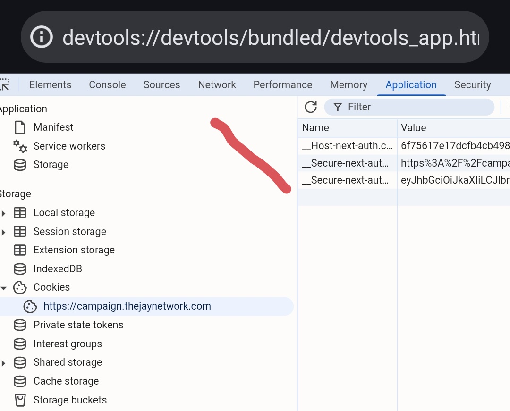

<div align="center">

# 🤖 JayNetwork BOT

[](https://nodejs.org)
[](https://pptr.dev)
[](LICENSE)
[](https://t.me/AirDropXDevs)

**Auto Daily Check-in + Task Completion Bot for [The Jay Network](https://campaign.thejaynetwork.com/?ref=FA763E0D)**

> 🔗 **Register here:** [The Jay Network](https://campaign.thejaynetwork.com/?ref=FA763E0D)

</div>

---

## ✨ Features

- 🎁 **Auto Daily Login Claim** — claims daily JAY rewards every cycle
- 📋 **Auto Task Completion** — completes all available pending tasks
- 🔒 **Proxy Support** — rotate proxies per account via `proxies.txt`
- 👥 **Multi-Account** — run unlimited accounts from `accounts.txt`
- 💾 **Task State Persistence** — tracks completed tasks per account in JSON
- 🕐 **Auto Daily Scheduling** — sleeps and re-runs every 24h with random delay
- 🌐 **Random User Agents** — 10 rotating mobile/desktop agents for anti-detection
- ⏭️ **Smart Task Skipping** — auto-skips referral tasks and already-done tasks

---

## 📋 Requirements

- [Node.js](https://nodejs.org) v18+
- Chromium installed on your system
- npm packages: `puppeteer-core`, `proxy-chain`

> ⚠️ **Important:** The bot uses `puppeteer-core` — it does **NOT** bundle Chromium automatically.  
> You must install Chromium separately and set the correct path in `index.js`.

---

## 🚀 Installation

### 1. Clone the repo

```bash
git clone https://github.com/mejri02/JayNetwork.git
cd JayNetwork
```

### 2. Install Node dependencies

```bash
npm install
```

### 3. Install Chromium (if not already installed)

**Ubuntu / Debian / VPS:**
```bash
sudo apt update
sudo apt install -y chromium-browser
# verify path
which chromium-browser
```

**Arch Linux:**
```bash
sudo pacman -S chromium
which chromium
```

**macOS (Homebrew):**
```bash
brew install --cask chromium
```

**Windows:**  
Download and install [Google Chrome](https://www.google.com/chrome/) or [Chromium](https://www.chromium.org/getting-the-chromium-projects/) manually.

---

## ⚙️ Configuration

### Set Chromium Path

Open `index.js` and update the `CHROME_PATH` constant to match your Chromium installation:

```js
// index.js — top of file
const CHROME_PATH = '/usr/bin/chromium'; // ← Change this to your actual path
```

**Common paths by OS:**

| OS | Default Path |
|----|-------------|
| Ubuntu / Debian | `/usr/bin/chromium-browser` |
| Arch Linux | `/usr/bin/chromium` |
| macOS (Homebrew) | `/opt/homebrew/bin/chromium` |
| Windows (Chrome) | `C:\\Program Files\\Google\\Chrome\\Application\\chrome.exe` |

To find your path on Linux/macOS, run:
```bash
which chromium || which chromium-browser
```

---

## 🍪 How to Get Your Session Token

The bot authenticates using your `__Secure-next-auth.session-token` cookie from the Jay Network campaign site.

### Step-by-step:

1. Open [The Jay Network](https://campaign.thejaynetwork.com/?ref=FA763E0D) in your browser and **log in**
2. Press **F12** (or right-click → **Inspect**) to open DevTools
3. Go to the **Application** tab
4. In the left panel, expand **Cookies** → click on `https://campaign.thejaynetwork.com`
5. In the cookie table on the right, find **`__Secure-next-auth.session-token`**
6. Copy the full **Value** — the long string starting with `eyJ...`



> 📌 The arrow in the image above points to the cookie table. Your session token is the value in the third row (`__Secure-next-aut...` → value starting with `eyJhb...`).

---

## 📝 Setup Files

### `accounts.txt` — Session Tokens

Paste each copied token on its own line:

```
eyJhbGciOiJIUzI1NiIsInR5cCI6IkpXVCJ9...
eyJhbGciOiJIUzI1NiIsInR5cCI6IkpXVCJ9...
```

### `proxies.txt` — Proxies (Optional)

```
http://user:pass@ip:port
http://user:pass@ip:port
```

---

## ▶️ Usage

```bash
node index.js
```

You'll see a menu:

```
╔══════════════════════════════════════════════════════════╗
║                    🤖 JAY NETWORK BOT                     ║
║              Daily Check-in + Auto Tasks                  ║
╚══════════════════════════════════════════════════════════╝

  1. 🚀 Run WITHOUT proxies (direct connection)
  2. 🔒 Run WITH proxies from proxies.txt
  3. ❌ Exit
```

- Select `1` for direct connection
- Select `2` to use proxies from `proxies.txt`

The bot runs continuously, sleeping ~24h between cycles with a random offset.

---

## 📁 File Structure

```
JayNetwork/
├── index.js               # Main bot file
├── accounts.txt           # Session tokens (one per line)
├── proxies.txt            # Proxies (optional)
├── completed_tasks.json   # Auto-generated task state
└── README.md
```

---

## 📊 Example Output

```
✅ [12:00:01] [Account 1] Day 3 claimed! +5 JAY
📋 [12:00:03] [Account 1] Attempting: Follow on Twitter (+10 JAY)
✅ [12:00:07] [Account 1] Completed! +10 JAY
⏭️ [12:00:08] [Account 1] Skipping referral task: Invite Friends
══════════════════════════════════════════════════
  📊 TODAY: +3 tasks | +25 JAY
══════════════════════════════════════════════════
  💤 Sleeping until tomorrow (2h 34m random delay)
```

---

## ⚠️ Disclaimer

This bot is for educational purposes only. Use at your own risk. The developer is not responsible for any account bans or losses.

---

<div align="center">

Made with ❤️ by [mejri02](https://github.com/mejri02) • [Telegram](https://t.me/AirDropXDevs)

</div>
